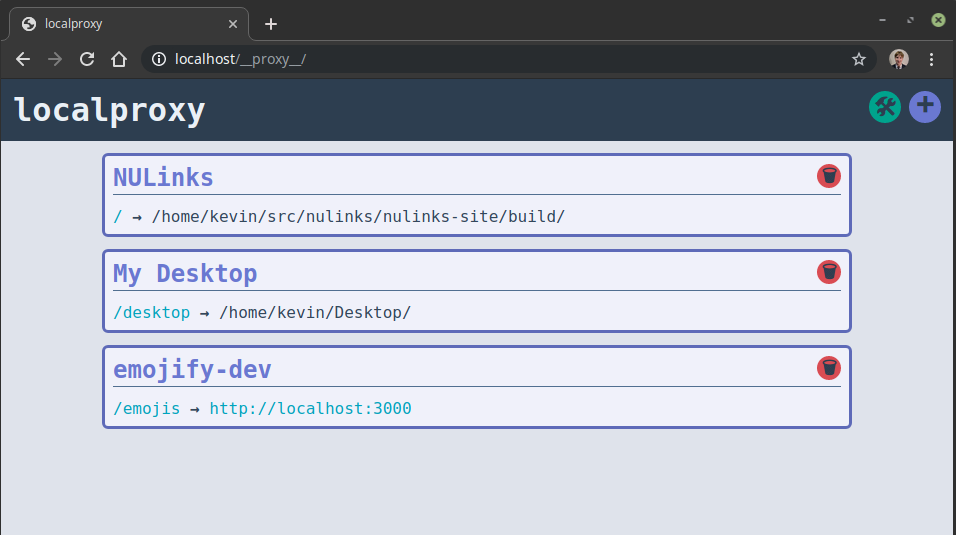

# localproxy
Dynamically run multiple web applications on routes on http://localhost:80.

Capable of mounting static routes or proxying requests to other servers.



## Install

1. Install the `.deb` file from the releases tab.

The `.deb` assumes a few things:
- `nginx` installed with the default site disabled.
- `sudo` installed with `/etc/sudoers.d` configured properly.
- `systemd` with unit file installed in `/lib/systemd/system`.
- `amd64` system (mostly because it bundles a `amd64` node runtime).

Review the `build-deb.sh` script to get an idea of how to do it manually if you aren't on a debian based system.

## Usage

Access the UI at http://localhost:80/__proxy__.

## API

Send API requests to `/__proxy__/api`.

While processing a `POST` or `DELETE` request, the nginx config will be immediately updated. 

### `GET`

Get requests will simply return the list of currently installed proxy apps.

Response: `App[]`

### `POST`

Post requests will install a proxy app. Note that this will overwrite any other apps.

Request Body: `InstallRequest`
Response: empty

### `DELETE`

Delete requests will uninstall a proxy app.

Request Body: `DeleteRequest`
Response: empty

### Types

```ts
// This route will serve assets from the filesystem
type StaticRoute = {
  static: true,
  route: string, // the route to mount the filesystem server at. This should NOT end with a trailing slash.
  staticDir: string, // the directory on the filesystem to mount. Must end with a trailing slash.
}

// This route will proxy requests to a destination server
type ProxyRoute = {
  static: false,
  route: string, // the route to mount the destination server at. This should NOT end with a trailing slash.
  hostname: string, // the hostname of the destination server.
  port: number // the port of the destination server.
  trimRoute: boolean // whether to trim the route or not before passing requests to the destination server.
}

type Route = ProxyRoute | StaticRoute

type App = {
  id: string // a unique ID for this app.
  name: string // name of the app.
  routes: Route[]
}

type InstallRequest = App

type DeleteRequest = {
  id: string // the ID of the app to uninstall.
}
```

## Development

To test changes to the server, you can stop the systemd service and then run the server manually as user `localproxy` (e.g. `sudo -u localproxy node ./server.js`)

To test changes to proxy-ui, you can either:
- Run a build of proxy-ui after every change, or
- Do a find-in-project for all `DEVBUILD` comments and follow the instructions. Then you'll be able to `npm start` inside of `proxy-ui` and have it work correctly.
- Future Goal: If we can figure out how to get create-react-app's webpack-dev-server happy with being routed to by localproxy, we should be able to mount the `proxy-ui` dev server inside of localproxy. Then we wouldn't need any of the `DEVBUILD` changes.